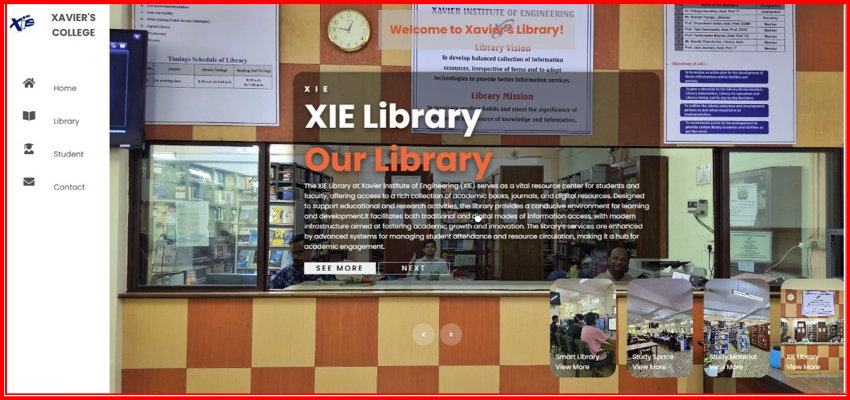
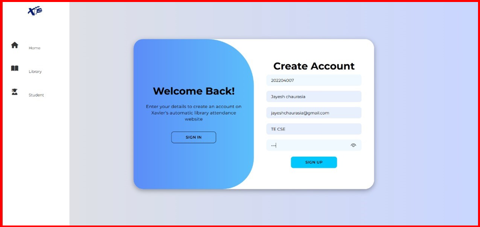
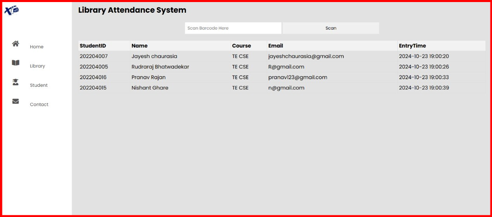
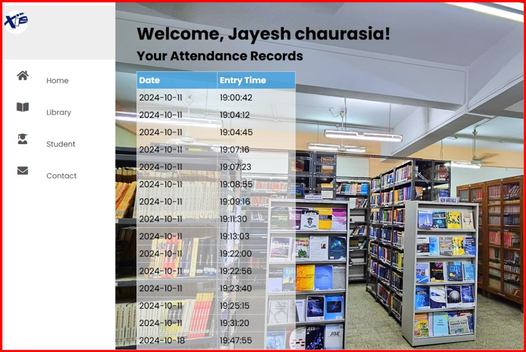
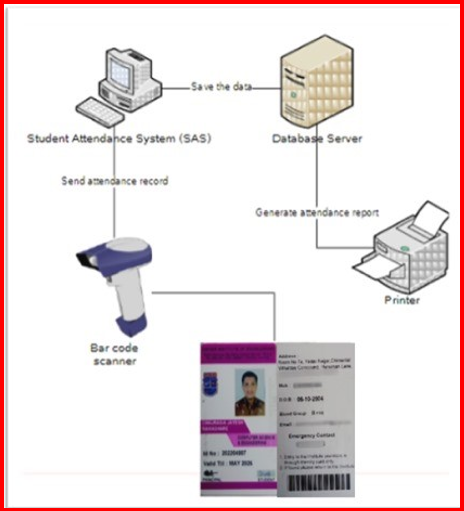

# Library Attendance System (MongoDB Atlas, No PHP/Apache)

## Overview
This project is a modern, full-stack Library Attendance System that uses **MongoDB Atlas** as its backend database. The application is designed to be run as a static web app (no PHP, no Apache, no Compass required) and can be hosted on any static server or cloud platform. All backend logic is handled via MongoDB Atlas App Services (Realm Functions), and the frontend is built with HTML, CSS, and JavaScript.

---

## Features
- **Student Registration & Login**
- **Barcode/ID Card Attendance Scanning**
- **Attendance History & Filtering**
- **Admin Dashboard**
- **Modern, Responsive UI**
- **No PHP, No Apache, No Compass**
- **Cloud-native with MongoDB Atlas**

---

## Setup Instructions

### 1. MongoDB Atlas Setup
1. Create a free account at [MongoDB Atlas](https://www.mongodb.com/cloud/atlas)
2. Create a new cluster (M0 free tier is fine)
3. Add a database user with read/write permissions
4. Add your IP address (or 0.0.0.0/0 for development) in Network Access
5. Click "Browse Collections" and create a database named `xie` with collections `students` and `attendance`

### 2. Importing Data (Optional)
If you have JSON data to import:
```sh
mongoimport --uri="mongodb+srv://<username>:<password>@<cluster-url>/xie" --collection=students --file=students.json
mongoimport --uri="mongodb+srv://<username>:<password>@<cluster-url>/xie" --collection=attendance --file=attendance.json
```

### 3. MongoDB Atlas App Services (Realm)
1. In Atlas, go to **App Services** > **Create App**
2. Link to your cluster
3. Set up authentication (Email/Password or custom JWT)
4. Create Realm Functions for login, signup, attendance, and data queries
5. Set rules for collections to allow appropriate access
6. Deploy your app and note your App ID

### 4. Frontend Setup
1. Clone/download this repository
2. Open `js/config.js` and set your Realm App ID:
   ```js
   const REALM_APP_ID = "your-realm-app-id";
   ```
3. Serve the project with any static server, e.g.:
   ```sh
   npx serve .
   # or
   python -m http.server 8000
   # or
   node server.js (if you have a simple Express static server)
   ```
4. Open your browser to `http://localhost:8000`

### 5. Exporting Data
To export data from MongoDB Atlas:
```sh
mongoexport --uri="mongodb+srv://<username>:<password>@<cluster-url>/xie" --collection=students --out=students.json
mongoexport --uri="mongodb+srv://<username>:<password>@<cluster-url>/xie" --collection=attendance --out=attendance.json
```

---

## Screenshots & Architecture

### Home Page

*The landing page for the Library Attendance System, featuring navigation and quick access to all modules.*

### Student Login

*The login page where students enter their credentials to access the system.*

### Attendance Entry After ID Card Scanning

*The interface shown after a student scans their ID card/barcode, confirming successful attendance entry.*

### Student Attendance Checking Page

*Students can view and filter their attendance history, with options for date and branch filtering.*

### System Architecture Design

*High-level architecture diagram showing the flow between the frontend, MongoDB Atlas App Services, and the database.*

---

## Contributing
- Fork the repo and submit pull requests for improvements
- Open issues for bugs or feature requests
- All contributions are welcome!

---

## License
This project is open-source and available under the MIT License. 